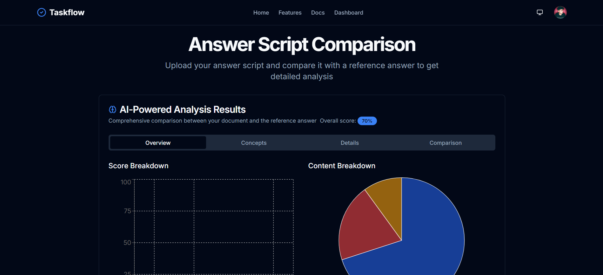
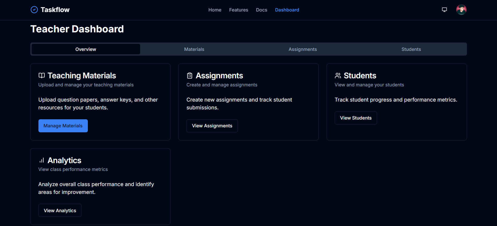

# TaskFlow - Streamlining Your Workflow


TaskFlow is a modern, intuitive application designed to streamline your document processing and task management workflows. By leveraging cutting-edge technologies like Google's Document AI and Firebase, TaskFlow offers a seamless experience from document upload to data extraction and task assignment.

## Features

-   **Document Processing:** Utilizes Google's Document AI to intelligently extract text and data from uploaded documents.
    
-   **Task Management:** Assign and manage tasks associated with processed documents, ensuring efficient workflow.
    
-   **User Authentication:** Secure user authentication via NextAuth.js with Google and GitHub OAuth.
-   **Real-time Updates:** Leverages Convex for real-time data synchronization and updates.
-   **Responsive Design:** A fully responsive design ensures a seamless experience across devices.
    

## Technologies Used

-   **Next.js:** React framework for building performant web applications.
-   **NextAuth.js:** Authentication library for secure user management.
-   **Google Document AI:** Cloud-based document processing and data extraction.
-   **Firebase:** Backend-as-a-service for database, storage, and authentication.
-   **Convex:** Real-time data platform for seamless updates.
-   **Tailwind CSS:** Utility-first CSS framework for styling.

## Setup Instructions

Follow these steps to get TaskFlow up and running on your local machine:

1.  **Clone the repository:**

    ```bash
    git clone https://github.com/your-username/taskflow.git
    cd taskflow
    ```

2.  **Install dependencies:**

    ```bash
    npm install
    # or
    yarn install
    # or
    pnpm install
    ```

3.  **Set up environment variables:**

    -   Create a `.env.local` file in the root directory.
    -   Populate the `.env.local` file with the necessary environment variables.  Refer to the `.env.example` file for a list of required variables.

    ```bash
    NEXTAUTH_URL=http://localhost:3000
    NEXTAUTH_SECRET=your_nextauth_secret
    GOOGLE_CLIENT_ID=your_google_client_id
    GOOGLE_CLIENT_SECRET=your_google_client_secret
    GITHUB_ID=your_github_id
    GITHUB_SECRET=your_github_secret
    NEXT_PUBLIC_CONVEX_URL=https://acoustic-jackal-429.convex.cloud
    NEXT_PUBLIC_GEMINI_API_KEY=your_gemini_api_key
    NEXT_PUBLIC_GCP_PROJECT_ID=your_gcp_project_id
    NEXT_PUBLIC_DOCAI_PROCESSOR_ID=your_docai_processor_id
    NEXT_PUBLIC_FIREBASE_API_KEY=your_firebase_api_key
    NEXT_PUBLIC_FIREBASE_AUTH_DOMAIN=taskflow-8a265.firebaseapp.com
    NEXT_PUBLIC_FIREBASE_PROJECT_ID=taskflow-8a265
    NEXT_PUBLIC_FIREBASE_STORAGE_BUCKET=askflow-8a265.firebasestorage.app
    NEXT_PUBLIC_FIREBASE_MESSAGING_SENDER_ID=1076116010959
    NEXT_PUBLIC_FIREBASE_APP_ID=1:1076116010959:web:f56dc75ba449254dc644ba
    NEXT_PUBLIC_FIREBASE_MEASUREMENT_ID=G-JX6RL3SXBM
    GOOGLE_APPLICATION_CREDENTIALS=./taskflow_keys.json
    NEXT_PUBLIC_DOCAI_LOCATION=eu
    ```

    **Important:** Never commit your `.env.local` file to version control to protect your credentials.

4.  **NextAuth Route Handler:**

    Ensure that the NextAuth.js route handler file is named `[...nextauth].ts` and is located in the `app/api/auth` directory. This is crucial for Next.js to correctly route authentication requests.

5.  **Run the application:**

    ```bash
    npm run dev
    # or
    yarn dev
    # or
    pnpm dev
    ```

6.  **Access the application:**

    Open your browser and navigate to `http://localhost:3000`.

## Environment Variables

Here's a list of the environment variables you need to configure:

-   `NEXTAUTH_URL`: The URL of your NextAuth.js deployment.
-   `NEXTAUTH_SECRET`: A secret key for NextAuth.js.
-   `GOOGLE_CLIENT_ID`: Your Google OAuth client ID.
-   `GOOGLE_CLIENT_SECRET`: Your Google OAuth client secret.
-   `GITHUB_ID`: Your GitHub OAuth client ID.
-   `GITHUB_SECRET`: Your GitHub OAuth client secret.
-   `NEXT_PUBLIC_CONVEX_URL`: The URL of your Convex deployment.
-   `NEXT_PUBLIC_GEMINI_API_KEY`: API key for Google Gemini.
-   `NEXT_PUBLIC_GCP_PROJECT_ID`: Your Google Cloud Project ID.
-   `NEXT_PUBLIC_DOCAI_PROCESSOR_ID`: Your Document AI Processor ID.
-   `NEXT_PUBLIC_FIREBASE_API_KEY`: Your Firebase API key.
-   `NEXT_PUBLIC_FIREBASE_AUTH_DOMAIN`: Your Firebase Auth domain.
-   `NEXT_PUBLIC_FIREBASE_PROJECT_ID`: Your Firebase Project ID.
-   `NEXT_PUBLIC_FIREBASE_STORAGE_BUCKET`: Your Firebase Storage bucket.
-   `NEXT_PUBLIC_FIREBASE_MESSAGING_SENDER_ID`: Your Firebase Messaging Sender ID.
-   `NEXT_PUBLIC_FIREBASE_APP_ID`: Your Firebase App ID.
-   `NEXT_PUBLIC_FIREBASE_MEASUREMENT_ID`: Your Firebase Measurement ID.
-   `GOOGLE_APPLICATION_CREDENTIALS`: Path to your Google Application Credentials JSON file.
-   `NEXT_PUBLIC_DOCAI_LOCATION`: Location of your Document AI processor.

## Contributing

Contributions are welcome! Please follow these steps:

1.  Fork the repository.
2.  Create a new branch for your feature or bug fix.
3.  Implement your changes.
4.  Submit a pull request.
